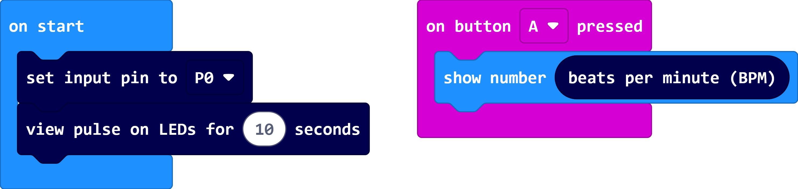

# pxt-pulse

Pulse Counting functions for micro:bit

The pulsesensor.com 'amped' board is open source hardware from World Famous Electronics llc at https://pulsesensor.com/.

## Use as Extension
This repository can be added as an **extension** in MakeCode.

* open [https://makecode.microbit.org/](https://makecode.microbit.org/)
* click on **New Project**
* click on **Extensions** under the gearwheel menu
* search for **https://github.com/obzbit/pxt-pulse** and import

## Example

  

```blocks
pulseSensor.setPinNumber(AnalogPin.P0)
pulseSensor.viewPulseFor(10)

input.onButtonPressed(Button.A, function () {
    basic.showNumber(pulseSensor.BPM())
})
```
